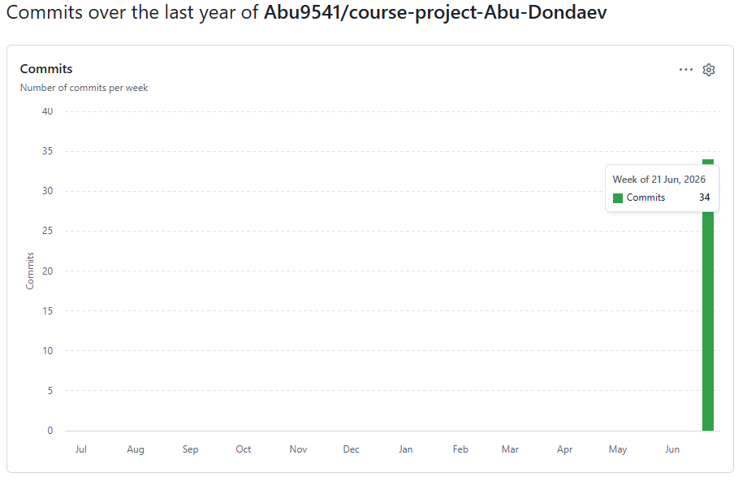
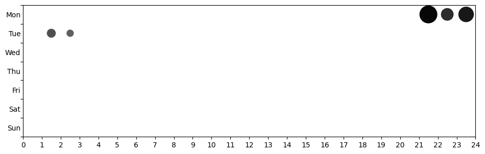

# ИС «Автосалон» — мобильное приложение

Курсовой проект по дисциплине «Программная инженерия».
**Тема:** Разработка мобильного приложения для информационной системы автосалона.
**Траектория:** В (мобильная разработка) · **Вариант:** Android Native (Kotlin).
**Архитектура:** PCMEF (Presentation–Control–Mediator–Entity–Foundation).

**Автор:** Дондаев Абу Умар-Пашаевич, группа ПИЖ-б-о-23-1, 09.03.04 «Программная инженерия», СКФУ.

---

## Что это

Клиент-серверная система автосалона: нативный Android-клиент на Kotlin/Compose,
серверная часть на Java/Spring Boot с REST API (JWT, OpenAPI) и база данных
PostgreSQL. Поддерживаются роли (клиент, менеджер, администратор), каталог
автомобилей, подробные карточки, покупка (в т.ч. в рассрочку), запись на
тест-драйв, избранное, отзывы, уведомления, аналитика и администрирование.

## Структура репозитория

```
course-project-Abu-Dondaev/
├── application/        # Исходный код (БД + сервер + Android-клиент)
│   ├── database/       # DDL и наполнение PostgreSQL
│   ├── backend/        # Spring Boot (PCMEF: control/mediator/entity/foundation)
│   ├── android/        # Android Native (Kotlin + Jetpack Compose)
│   └── docker-compose.yml
└── docs/               # Проектная документация по этапам МУ
    ├── 00-initiation/  01-requirements/  02-architecture/  03-database/
    ├── 04-detailed-design/  05-implementation/  06-refactoring/  07-management/
    ├── images/   README.md   REQUIREMENTS-COMPLIANCE.md
```

## Быстрый старт

```bash
cd application
docker compose up --build      # PostgreSQL + backend
```
Затем открыть `application/android` в Android Studio и запустить на эмуляторе
(API 26+). Подробности и демо-доступы — в
[`application/README.md`](application/README.md).

## Документация

- [Навигатор по всей документации](docs/README.md)
- [Соответствие требованиям МУ](docs/REQUIREMENTS-COMPLIANCE.md)
- [Архитектура PCMEF](docs/02-architecture/pcmef-architecture.md)
- [Проектирование БД](docs/03-database/database-design.md)

---

## Статистика разработки

Проект разрабатывался поэтапно в Git-репозитории (требование МУ, п. 1.2.3); историю
и статистику ниже можно проверить на вкладке **Insights** репозитория.

### Метрики Git
- Всего коммитов: 35
- Период разработки: 10.02.2026 – 23.06.2026

### Активность коммитов


### Распределение по дням недели и часам

