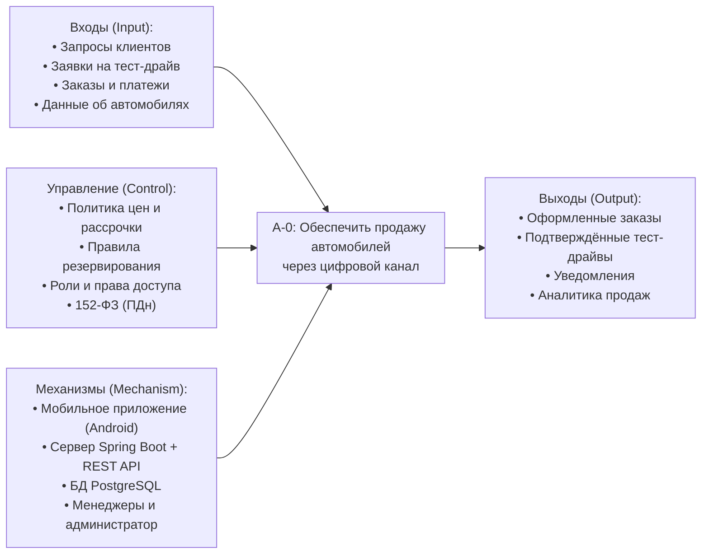
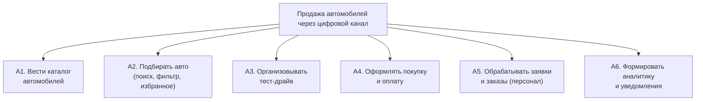

# Диаграмма бизнес-контекста (IDEF0, уровень A-0)

Контекстная диаграмма верхнего уровня описывает систему как единую функцию
**«Обеспечить продажу автомобилей через цифровой канал»** в нотации IDEF0 (ICOM:
Input — Control — Output — Mechanism).

## A-0: Контекст системы

## Описание ICOM

| Категория | Содержание |
|-----------|------------|
| **Inputs (входы)** | Поисковые запросы и фильтры клиента; заявки на тест-драйв; заказы (полная оплата / рассрочка); платёжные операции; сведения об автомобилях от администратора. |
| **Controls (управление)** | Бизнес-политика автосалона (цены, ставки рассрочки, правила резервирования), ролевое разграничение доступа, требования к защите персональных данных (152-ФЗ). |
| **Outputs (выходы)** | Оформленные и оплаченные заказы; подтверждённые/завершённые записи на тест-драйв; уведомления клиентам и персоналу; аналитические показатели для руководства. |
| **Mechanisms (механизмы)** | Мобильный клиент на Android, серверная часть (Spring Boot + REST), СУБД PostgreSQL, а также роли-исполнители: клиент, менеджер, администратор. |

## Декомпозиция A0 (основные бизнес-функции первого уровня)

Дальнейшая детализация бизнес-функций приведена в [диаграмме бизнес-прецедентов
(BUC)](business-use-cases.md), а переход к системным функциям — в
[Use Case диаграмме](../01-requirements/use-case-diagram.md).
