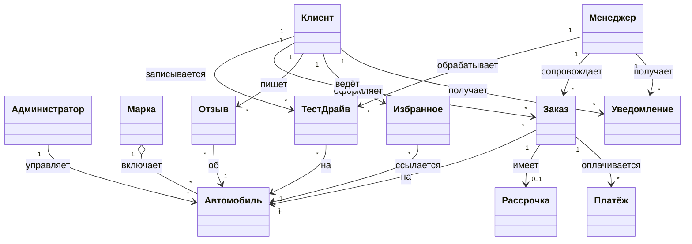

# Модель бизнес-классов (высокоуровневая)

Концептуальная модель ключевых сущностей предметной области и их связей (без атрибутов
реализации и технических деталей). Уточняется на этапе требований в
[Domain Model](../01-requirements/domain-model.md).

## Краткое описание сущностей

| Сущность | Назначение |
|----------|-----------|
| **Клиент / Менеджер / Администратор** | Роли пользователей системы с разными правами. |
| **Марка** | Производитель; группирует автомобили. |
| **Автомобиль** | Товарная единица с характеристиками, ценой и статусом наличия. |
| **ТестДрайв** | Запись клиента на пробную поездку с указанием центра и времени. |
| **Заказ** | Намерение купить авто; имеет тип оплаты и статус. |
| **Рассрочка** | План платежей по заказу (взнос, срок, ставка, ежемесячный платёж). |
| **Платёж** | Операция оплаты заказа (имитация эквайринга). |
| **Отзыв** | Оценка и комментарий клиента об автомобиле. |
| **Избранное** | Связка «клиент ↔ автомобиль» для быстрого доступа. |
| **Уведомление** | Сообщение о событии для клиента или персонала. |

## Ключевые бизнес-правила

1. Автомобиль может быть продан **только один раз**: при оформлении заказа он
   резервируется, при завершении сделки — помечается как «продан» и скрывается из каталога.
2. На один автомобиль одновременно допускается **один активный заказ**.
3. Первоначальный взнос по рассрочке должен быть **строго меньше** стоимости автомобиля.
4. Записи на тест-драйв одного автомобиля не должны пересекаться по времени (интервал ≥ 1 ч).
5. Клиент может оставить **один отзыв** на конкретный автомобиль.
