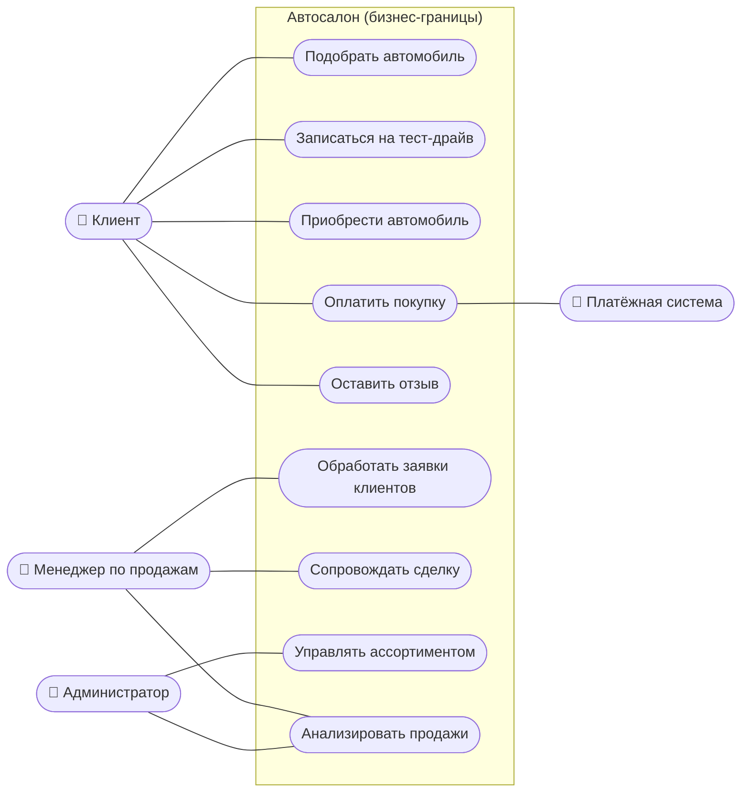

# Диаграмма бизнес-прецедентов (BUC)

Бизнес-прецеденты описывают, **что** бизнес делает для своих стейкхолдеров (на уровне
предметной области, без привязки к программной реализации).

## Перечень бизнес-прецедентов

| ID | Бизнес-прецедент | Инициатор | Ценность для бизнеса |
|----|------------------|-----------|----------------------|
| BUC-1 | Подобрать автомобиль | Клиент | Привлечение и удержание покупателя, рост конверсии |
| BUC-2 | Записаться на тест-драйв | Клиент | Перевод интереса в визит/сделку |
| BUC-3 | Приобрести автомобиль | Клиент | Основная выручка |
| BUC-4 | Оплатить покупку | Клиент | Поступление средств, фиксация сделки |
| BUC-5 | Оставить отзыв | Клиент | Социальное доказательство, репутация |
| BUC-6 | Обработать заявки клиентов | Менеджер | Снижение потерь обращений |
| BUC-7 | Сопровождать сделку | Менеджер | Доведение заказа до завершения |
| BUC-8 | Управлять ассортиментом | Администратор | Актуальность каталога |
| BUC-9 | Анализировать продажи | Менеджер/Администратор | Управленческие решения |

## Соответствие бизнес-функциям IDEF0

| Бизнес-функция (IDEF0) | Бизнес-прецеденты |
|------------------------|-------------------|
| A1. Вести каталог | BUC-8 |
| A2. Подбирать авто | BUC-1, BUC-5 |
| A3. Организовывать тест-драйв | BUC-2 |
| A4. Оформлять покупку и оплату | BUC-3, BUC-4 |
| A5. Обрабатывать заявки и заказы | BUC-6, BUC-7 |
| A6. Аналитика и уведомления | BUC-9 |

> На этапе требований бизнес-прецеденты детализируются в системные —
> см. [Use Case диаграмму](../01-requirements/use-case-diagram.md).
