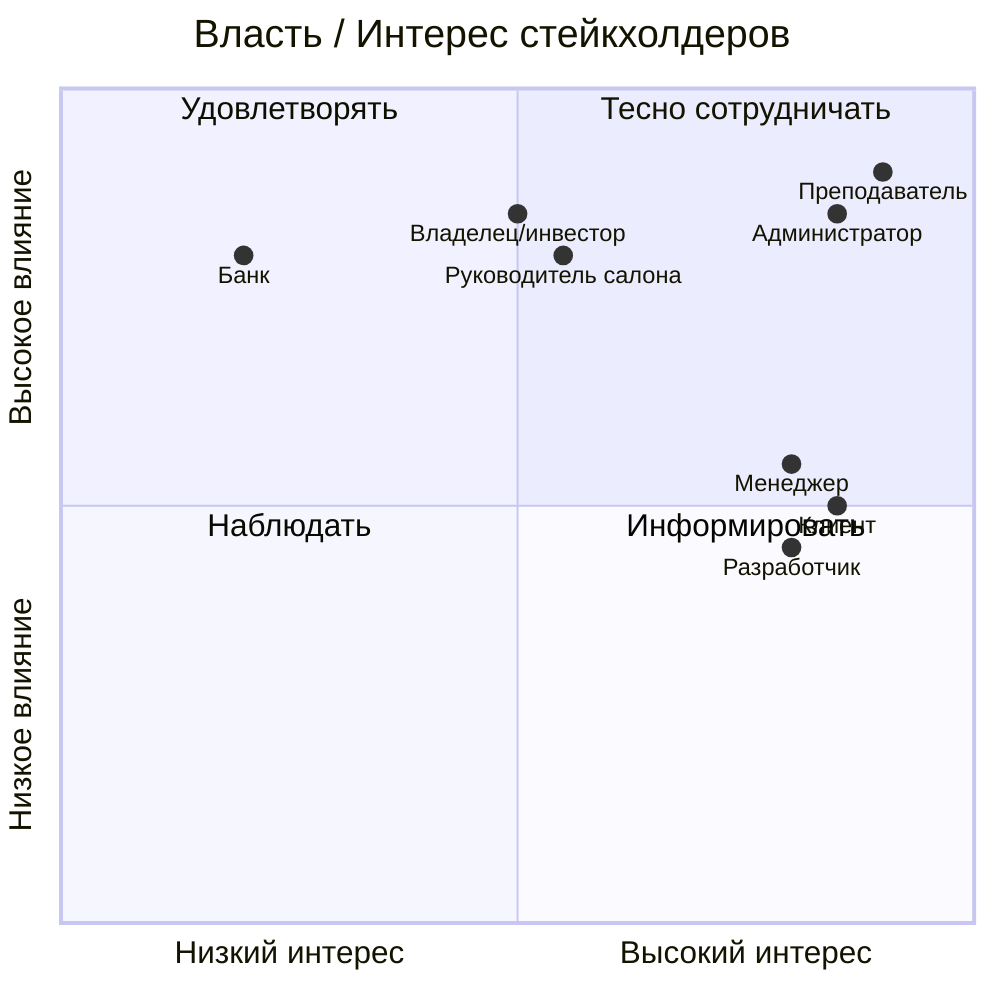

# Матрица стейкхолдеров

Анализ заинтересованных сторон проекта ИС «Автосалон» по модели «власть/интерес»
(Power/Interest).

| № | Стейкхолдер | Роль/интерес | Влияние | Заинтересованность | Стратегия работы |
|---|-------------|--------------|---------|--------------------|--------------------|
| 1 | **Клиент (покупатель)** | Удобный подбор и покупка авто | Среднее | Высокая | Активно вовлекать (UX, скорость, прозрачность) |
| 2 | **Менеджер по продажам** | Быстрая обработка заявок, выполнение плана | Среднее | Высокая | Активно вовлекать (удобные инструменты, уведомления) |
| 3 | **Администратор системы** | Актуальный каталог, управление доступом | Высокое | Высокая | Тесно сотрудничать (ключевой пользователь) |
| 4 | **Руководитель салона** | Рост продаж, контроль показателей | Высокое | Средняя | Удовлетворять (аналитическая панель, KPI) |
| 5 | **Владелец/инвестор** | Окупаемость, прибыль | Высокое | Средняя | Удовлетворять (отчёт ROI, экономическое обоснование) |
| 6 | **Платёжная система (банк)** | Корректность платёжных операций | Высокое | Низкая | Информировать (соблюдение протокола оплаты, PCI DSS) |
| 7 | **Преподаватель / комиссия** | Соответствие МУ, качество инженерных решений | Высокое | Высокая | Тесно сотрудничать (документация, защита) |
| 8 | **Разработчик (автор)** | Реализация в срок, оценка | Среднее | Высокая | Активно вовлекать (планирование, инкременты) |

## Карта «власть/интерес»

## Выводы

- **Ключевые пользователи** — клиент, менеджер и администратор; их потребности
  определяют функциональные требования (см. [Use Case](../01-requirements/use-case-diagram.md)).
- **Лица, принимающие решения** — руководитель и владелец; для них предусмотрена
  аналитическая панель и экономическое обоснование.
- **Внешняя сторона** — банк/платёжная система; взаимодействие реализовано через
  имитацию платёжного шлюза с сохранением реального протокола (создание платежа →
  подтверждение).
