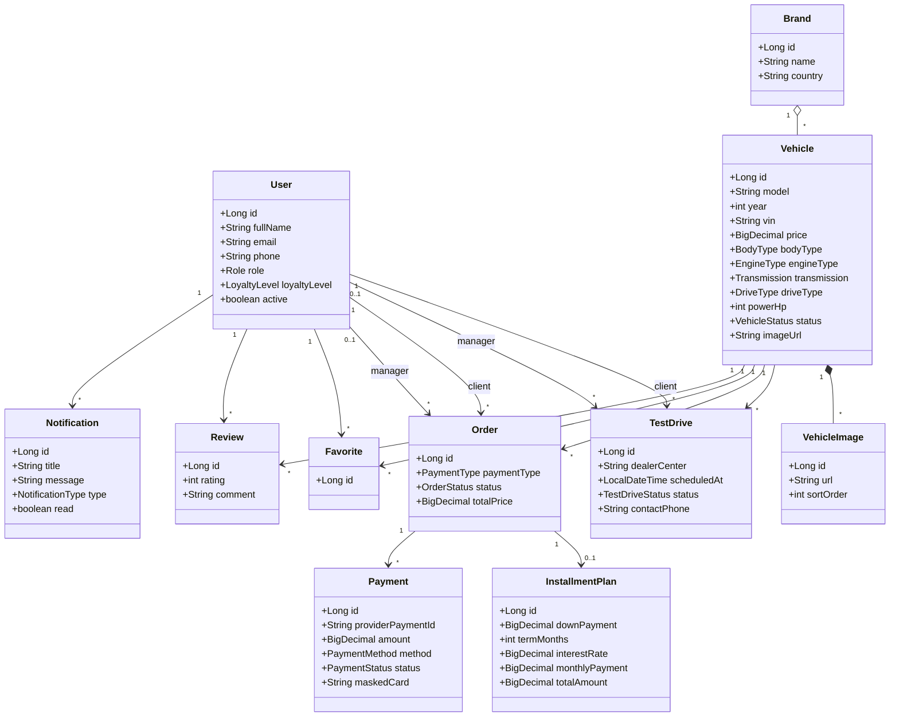

# Domain Model (концептуальная модель классов)

Концептуальная модель предметной области с ключевыми атрибутами и связями. Является
основой для проектирования сущностей (слой Entity) и схемы БД.

## Перечисления (Enumerations)

| Перечисление | Значения |
|--------------|----------|
| `Role` | CLIENT, MANAGER, ADMIN |
| `LoyaltyLevel` | STANDARD, SILVER, GOLD, PLATINUM |
| `VehicleStatus` | IN_STOCK, RESERVED, SOLD, UNAVAILABLE |
| `BodyType` | SEDAN, SUV, HATCHBACK, COUPE, WAGON, PICKUP, MINIVAN, CROSSOVER |
| `EngineType` | PETROL, DIESEL, HYBRID, ELECTRIC, GAS |
| `Transmission` | MANUAL, AUTOMATIC, ROBOT, CVT |
| `DriveType` | FWD, RWD, AWD |
| `TestDriveStatus` | PENDING, CONFIRMED, COMPLETED, CANCELLED, REJECTED |
| `OrderStatus` | PENDING, CONFIRMED, PAID, COMPLETED, CANCELLED |
| `PaymentType` | FULL, INSTALLMENT |
| `PaymentMethod` | CARD, CASH |
| `PaymentStatus` | PENDING, SUCCEEDED, FAILED |
| `NotificationType` | INFO, TEST_DRIVE, ORDER, INSTALLMENT, SYSTEM |

## Инварианты модели

- `Order.totalPrice > 0`; для `INSTALLMENT` обязателен связанный `InstallmentPlan`.
- `InstallmentPlan.downPayment < Vehicle.price`.
- `Review.rating ∈ [1..5]`; пара (`User`,`Vehicle`) уникальна.
- `Favorite`: пара (`User`,`Vehicle`) уникальна.
- `Vehicle.vin` уникален; `User.email` уникален.

> Физическая модель и DDL — в [docs/03-database](../03-database/database-design.md).
> Реализация сущностей (не анемичных, с бизнес-методами) — слой Entity.
