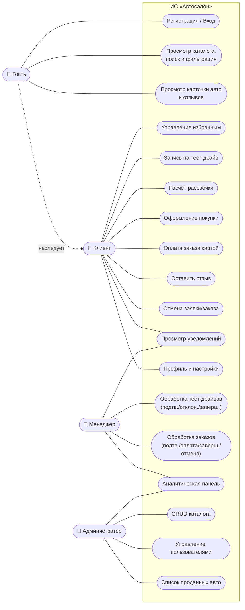

# Use Case диаграмма (системные прецеденты)

Системные прецеденты описывают функциональность ПО для каждой роли. Акторы образуют
иерархию: **Клиент** наследует возможности **Гостя**; **Менеджер** и **Администратор** —
сотрудники (персонал).

## Отношения include/extend

| Базовый прецедент | Отношение | Прецедент |
|-------------------|-----------|-----------|
| UC7 Оформление покупки | `«include»` | UC6 Расчёт рассрочки (для рассрочки) |
| UC7 Оформление покупки | `«include»` | UC8 Оплата заказа (переход сразу после оформления) |
| UC2 Просмотр каталога | `«extend»` | UC4 Управление избранным (для авторизованного клиента) |
| UC13 / UC14 | `«include»` | UC11 Уведомления (генерация уведомлений сторонам) |

## Перечень прецедентов с приоритетом

| ID | Прецедент | Актор | Приоритет |
|----|-----------|-------|-----------|
| UC1 | Регистрация / Вход | Гость | Высокий |
| UC2 | Каталог, поиск, фильтрация | Гость | Высокий |
| UC3 | Карточка авто и отзывы | Гость | Высокий |
| UC4 | Избранное | Клиент | Средний |
| UC5 | Запись на тест-драйв | Клиент | Высокий |
| UC6 | Расчёт рассрочки | Клиент | Средний |
| UC7 | Оформление покупки | Клиент | Высокий |
| UC8 | Оплата заказа | Клиент | Высокий |
| UC9 | Отзыв | Клиент | Низкий |
| UC10 | Отмена заявки/заказа | Клиент | Средний |
| UC11 | Уведомления | Клиент/Менеджер | Средний |
| UC12 | Профиль и настройки | Клиент | Низкий |
| UC13 | Обработка тест-драйвов | Менеджер | Высокий |
| UC14 | Обработка заказов | Менеджер | Высокий |
| UC15 | Аналитика | Менеджер/Админ | Средний |
| UC16 | CRUD каталога | Админ | Высокий |
| UC17 | Управление пользователями | Админ | Средний |
| UC18 | Проданные авто | Админ | Низкий |

> Детальные спецификации ключевых прецедентов — в
> [use-case-specifications.md](use-case-specifications.md).
