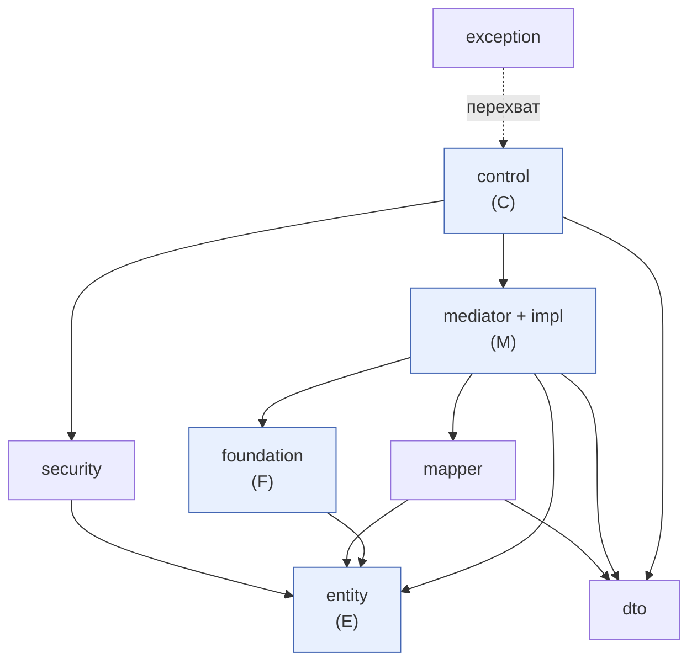

# Диаграмма зависимостей (ацикличность)

Граф зависимостей между пакетами сервера. Все рёбра направлены **сверху вниз** —
циклов нет (граф ациклический, DAG), что является обязательным требованием PCMEF.

## Правила направленности

| Слой | Может зависеть от | НЕ может зависеть от |
|------|-------------------|----------------------|
| `control` (C) | `mediator`(интерфейсы), `dto`, `security` | `foundation` напрямую, `entity` (минимально) |
| `mediator` (M) | `entity`, `foundation`(интерфейсы), `dto`, `mapper` | `control` (не знает о вышележащем слое) |
| `entity` (E) | — (самодостаточен) | `control`, `mediator`, `foundation` |
| `foundation` (F) | `entity` | `control`, `mediator` |

## Проверка отсутствия циклов

- **Ключевой инвариант:** ни один нижний слой не импортирует верхний. В частности,
  `entity` не зависит ни от чего, `foundation` зависит только от `entity`.
- **Способ проверки:** анализ `import`-ов (статический анализ), а также сам факт того,
  что слои собираются «снизу вверх».
- **Вспомогательные пакеты** (`dto`, `mapper`, `security`, `exception`, `config`) не
  образуют циклов: `mapper` преобразует `entity ↔ dto`, `security` опирается на `entity`
  (роли пользователя), `exception` перехватывается глобальным обработчиком в слое представления API.

## Клиент (Android)

На клиенте направленность аналогична: `presentation` → `data.repository` →
(`data.remote` | `data.local`) → `dto`/`entity (Room)`. ViewModel не обращается к Retrofit
или Room напрямую — только через репозитории. DI собирается в `di.AppContainer`
(ручной Service Locator), что делает зависимости явными и однонаправленными.
