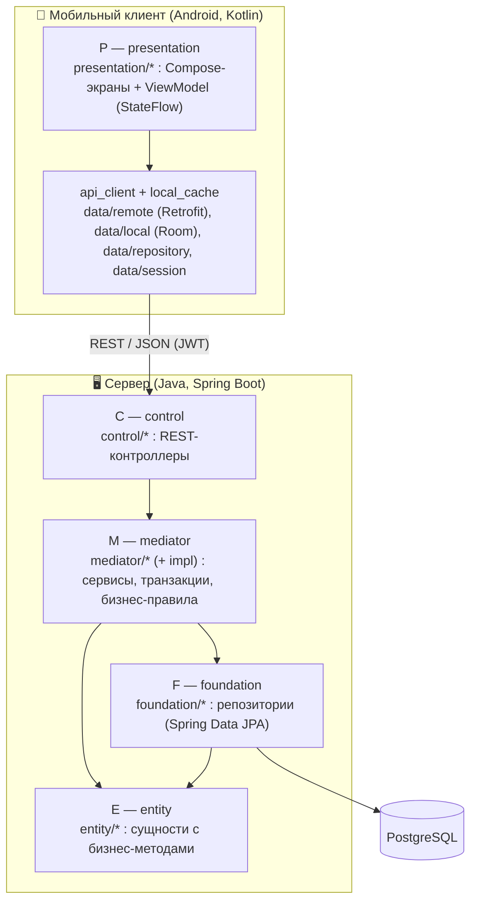

# Диаграмма пакетов (PCMEF)

Система реализует адаптированный для клиент-серверного мобильного приложения паттерн
**PCMEF**. Зависимости направлены строго сверху вниз: **P → C → M → E → F**.

## Распределение слоёв между клиентом и сервером

## Соответствие слоёв PCMEF и пакетов кода

| Слой PCMEF | Сторона | Пакет / модуль | Ответственность |
|------------|---------|----------------|-----------------|
| **Presentation** | Клиент | `ru.ncfu.autoshow.presentation.*`, `navigation`, `ui` | Экраны Compose, ViewModel, навигация, тема |
| *(api_client / local_cache)* | Клиент | `data.remote`, `data.local`, `data.repository`, `data.session`, `data.settings` | Retrofit-API, Room-кэш, репозитории, сессия/настройки |
| **Control** | Сервер | `control` | Приём HTTP-запросов, валидация DTO, делегирование |
| **Mediator** | Сервер | `mediator` (+ `mediator.impl`) | Бизнес-логика, транзакции, правила |
| **Entity** | Сервер | `entity` (+ `entity.enums`) | Сущности с бизнес-методами (не анемичные) |
| **Foundation** | Сервер | `foundation` | Репозитории доступа к данным |
| *(вспомогательные)* | Сервер | `dto`, `mapper`, `security`, `exception`, `config` | DTO, Data Mapper, JWT/RBAC, обработка ошибок, конфигурация |

## Принципы соблюдения PCMEF

1. **Строгая иерархия:** контроллеры не обращаются к репозиториям напрямую — только через
   сервисы Mediator; репозитории не содержат бизнес-логики.
2. **Коммуникация через интерфейсы:** Control зависит от интерфейсов сервисов
   (`*Service`), Mediator — от интерфейсов репозиториев (Spring Data). См.
   [layer-interfaces.md](layer-interfaces.md).
3. **Изоляция представления:** Presentation (клиент) общается с сервером только по REST,
   не зная о внутренней структуре сервера.
4. **Отсутствие циклов:** граф зависимостей ацикличен — см.
   [dependency-diagram.md](dependency-diagram.md).

> Подробное описание ответственности слоёв и обоснование — в
> [pcmef-architecture.md](pcmef-architecture.md) и [adr.md](adr.md).
