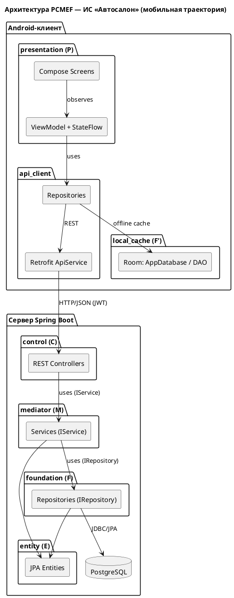

# Этап 2. Архитектурное проектирование (PCMEF)

Система построена на архитектурном паттерне **PCMEF**
(Presentation–Control–Mediator–Entity–Foundation). Зависимости направлены
строго сверху вниз: **P → C → M → E → F**. Циклические зависимости отсутствуют.

## 1. Адаптация PCMEF для мобильной траектории

Клиент-серверное приложение распределяет слои PCMEF между Android-клиентом и
сервером Spring Boot.



## 2. Ответственность слоёв (сервер)

| Слой | Пакет | Ответственность | НЕ должен |
|------|-------|-----------------|-----------|
| Presentation (P) | *(Android)* `presentation` | Отображение, ввод, состояния | Содержать бизнес-логику |
| Control (C) | `ru.ncfu.autoshow.control` | Приём запросов, маршрутизация, валидация (`@Valid`), коды ответов | Обращаться к БД напрямую |
| Mediator (M) | `ru.ncfu.autoshow.mediator` | Бизнес-логика, транзакции (`@Transactional`), бизнес-правила | Знать о Presentation |
| Entity (E) | `ru.ncfu.autoshow.entity` | Состояние и бизнес-методы (не анемичные) | Содержать логику доступа к данным |
| Foundation (F) | `ru.ncfu.autoshow.foundation` | Доступ к данным (Spring Data JPA) | Содержать бизнес-правила |

Вспомогательные пакеты: `dto` (контракты), `mapper` (Data Mapper),
`security` (JWT/роли), `exception` (глобальная обработка), `config`.

## 3. Интерфейсы между слоями

**Control → Mediator (IService)** — пример контракта:

```java
public interface VehicleService {
    PageResponse<VehicleSummaryResponse> search(String q, Long brandId, BodyType bodyType,
            VehicleStatus status, BigDecimal minPrice, BigDecimal maxPrice, Pageable pageable);
    VehicleResponse getById(Long id);
    VehicleResponse create(VehicleRequest request);
    VehicleResponse update(Long id, VehicleRequest request);
    void delete(Long id);
}
```

**Mediator → Foundation (IRepository)** — Spring Data JPA:

```java
public interface VehicleRepository extends JpaRepository<Vehicle, Long> {
    Page<Vehicle> search(...);
    boolean existsByVin(String vin);
    long countByStatus(VehicleStatus status);
}
```

Каждый сервис представлен **интерфейсом** (`mediator`) и **реализацией**
(`mediator.impl`), что обеспечивает коммуникацию через интерфейсы и
тестируемость (подмена зависимостей в модульных тестах).

## 4. Проверка правила зависимостей

- `control` → зависит от `mediator` (интерфейсы) и `dto`. Не импортирует `foundation`.
- `mediator.impl` → зависит от `foundation`, `entity`, `mapper`, `dto`. Не импортирует `control`.
- `entity` → не зависит ни от одного из вышележащих слоёв.
- `foundation` → зависит только от `entity`.

Граф ацикличен: **C → M → F → E** (E — листовой слой).

## 5. Архитектурные решения (ADR, кратко)

| № | Решение | Обоснование |
|---|---------|-------------|
| ADR-1 | PCMEF + клиент-сервер | Требование МУ; разделение ответственности, тестируемость по слоям |
| ADR-2 | Stateless-аутентификация по **JWT** | Масштабируемость, отсутствие серверной сессии, удобство для мобильного клиента |
| ADR-3 | **DTO + Data Mapper** на границе API | Доменные сущности не покидают сервер; защита от утечки внутренней модели и проблем ленивой загрузки при сериализации |
| ADR-4 | Hibernate `ddl-auto=update` + канонический `schema.sql` | Надёжность запуска для учебного проекта; в продакшене — Flyway/Liquibase |
| ADR-5 | Ручной DI-контейнер на клиенте (`AppContainer`) | Прозрачность, надёжная сборка без сложной настройки кодогенерации |
| ADR-6 | Room как `local_cache` | Оффлайн-режим: каталог доступен без сети (требование мобильной траектории) |
