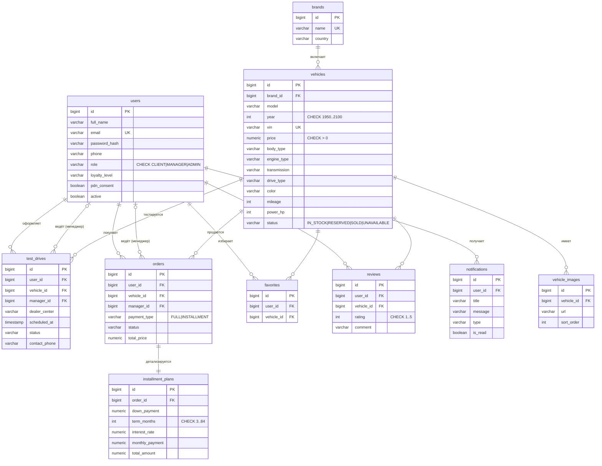

# Этап 3. Проектирование базы данных

СУБД: **PostgreSQL 16**. Нормализация — до **3НФ**. Целостность обеспечивается
первичными и внешними ключами, ограничениями `NOT NULL`, `UNIQUE`, `CHECK` и
индексами для часто запрашиваемых полей.

> DDL-скрипт: [`../../application/database/schema.sql`](../../application/database/schema.sql)
> Наполнение: [`../../application/database/seed.sql`](../../application/database/seed.sql)

## 1. ER-диаграмма (логическая модель)

## 2. Сущности (10 таблиц)

| Таблица | Назначение | Ключевые ограничения |
|---------|-----------|----------------------|
| `users` | Пользователи и роли | `email` UNIQUE; `role` CHECK; `loyalty_level` CHECK |
| `brands` | Марки автомобилей | `name` UNIQUE |
| `vehicles` | Автомобили | `vin` UNIQUE; FK→`brands`; CHECK на `year/price/power/mileage` и перечисления |
| `vehicle_images` | Фотогалерея (1:N) | FK→`vehicles` ON DELETE CASCADE |
| `test_drives` | Записи на тест-драйв | FK→`users`(клиент, менеджер), `vehicles`; `status` CHECK |
| `orders` | Заказы на покупку | FK→`users`, `vehicles`; `payment_type`/`status` CHECK; `total_price` CHECK |
| `installment_plans` | Рассрочка (1:1 к заказу) | `order_id` UNIQUE FK ON DELETE CASCADE; CHECK на срок/суммы |
| `favorites` | Избранное (N:M) | UNIQUE(`user_id`,`vehicle_id`) |
| `reviews` | Отзывы | UNIQUE(`user_id`,`vehicle_id`); `rating` CHECK 1..5 |
| `notifications` | Уведомления | FK→`users`; `type` CHECK |

Индексы созданы на внешние ключи и часто фильтруемые поля
(`vehicles.status`, `vehicles.price`, `vehicles.body_type`, статусы заявок и т.д.).

## 3. Обоснование нормализации (3НФ)

- **1НФ:** все атрибуты атомарны; повторяющиеся группы (изображения, отзывы)
  вынесены в отдельные таблицы (`vehicle_images`, `reviews`).
- **2НФ:** все таблицы имеют простой первичный ключ `id`; неключевые атрибуты
  полностью зависят от ключа.
- **3НФ:** отсутствуют транзитивные зависимости. Марка вынесена из `vehicles`
  в `brands` (нет дублирования названия/страны марки). Параметры рассрочки
  вынесены в `installment_plans` и зависят только от `order_id`.

## 4. Стратегия ORM (Entity → таблицы)

Используется **Spring Data JPA / Hibernate** (реализация паттерна **Data Mapper**).

| Приём | Реализация |
|-------|-----------|
| Сопоставление | JPA-аннотации (`@Entity`, `@Table`, `@Column`, `@ManyToOne`, `@OneToOne`, `@OneToMany`) |
| Первичные ключи | `@GeneratedValue(strategy = IDENTITY)` → `GENERATED BY DEFAULT AS IDENTITY` |
| Перечисления | `@Enumerated(EnumType.STRING)` → `VARCHAR` + `CHECK` |
| **Data Mapper** | Hibernate + явные классы-мапперы `*Mapper` (Entity ↔ DTO), отделяющие доменную модель от представления |
| **Identity Map** | Кэш первого уровня Hibernate (Persistence Context) гарантирует единственность объекта в рамках сессии |
| **Lazy Load** | `FetchType.LAZY` для коллекций (`vehicle.images`) и связей; загрузка по требованию внутри транзакции |
| Управление схемой | В приложении схему создаёт Hibernate (`ddl-auto=update`); `schema.sql` — эквивалентный канонический DDL-артефакт |

Соответствие сущностей и таблиц: пакет `ru.ncfu.autoshow.entity`
(`User`, `Brand`, `Vehicle`, `VehicleImage`, `TestDrive`, `Order`,
`InstallmentPlan`, `Favorite`, `Review`, `Notification`).
