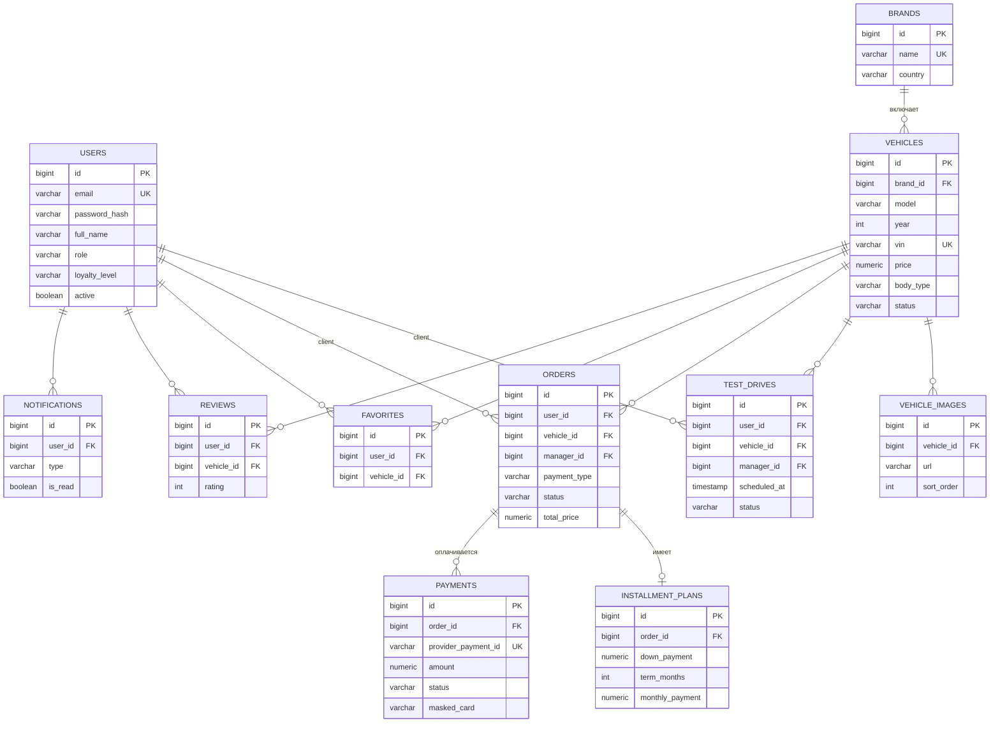

# ER-диаграмма (логическая модель данных)

Схема нормализована до 3НФ. Целостность обеспечивается PK, FK, UNIQUE, NOT NULL и CHECK.
Диаграмма рендерится прямо на GitHub (Mermaid). Каноничный DDL — в
[`application/database/schema.sql`](../../application/database/schema.sql); исходник для
PlantUML — [`application/database/er-diagram.puml`](../../application/database/er-diagram.puml).

## Перечень таблиц (11)

| Таблица | Назначение | Ключевые ограничения |
|---------|-----------|----------------------|
| `users` | Пользователи и роли | `email` UNIQUE; CHECK на роль/лояльность |
| `brands` | Марки | `name` UNIQUE |
| `vehicles` | Автомобили | `vin` UNIQUE; FK→brands; CHECK цена/год/статус |
| `vehicle_images` | Фотогалерея | FK→vehicles (ON DELETE CASCADE) |
| `test_drives` | Записи на тест-драйв | FK→users/vehicles/manager; CHECK статуса |
| `orders` | Заказы | FK→users/vehicles/manager; CHECK тип/статус/цена |
| `installment_plans` | Планы рассрочки | `order_id` UNIQUE (1:1); FK→orders |
| `payments` | Платежи | `provider_payment_id` UNIQUE; FK→orders; CHECK метод/статус |
| `favorites` | Избранное (N:M) | UNIQUE (user_id, vehicle_id) |
| `reviews` | Отзывы | UNIQUE (user_id, vehicle_id); CHECK rating 1..5 |
| `notifications` | Уведомления | FK→users; CHECK типа |

## Индексы

Созданы для часто фильтруемых/соединяемых полей: `vehicles(brand_id, status, price, body_type)`,
`test_drives(user_id, vehicle_id, status, scheduled_at)`, `orders(user_id, vehicle_id, status)`,
`payments(order_id)`, `favorites(user_id)`, `reviews(vehicle_id)`,
`notifications(user_id, is_read)`. Полный список — в `schema.sql`.
