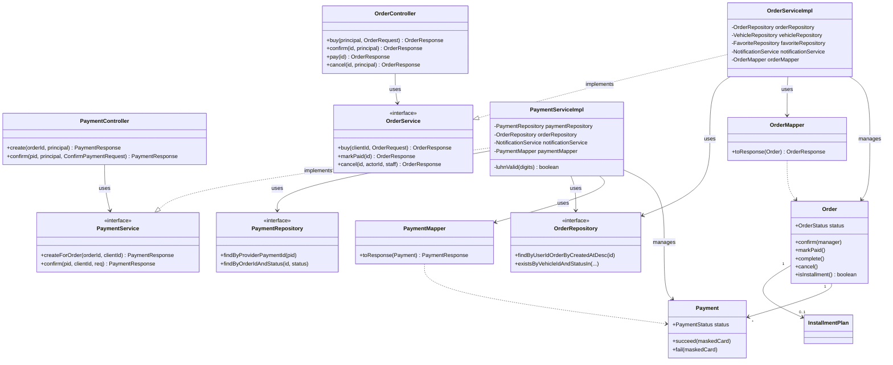

# Диаграмма классов проектирования

Детальная структура классов на примере среза **«Заказы и оплата»** — показывает слои
PCMEF, интерфейсы и применённые паттерны (Data Mapper, делегирование Control → Mediator →
Foundation).

## Замечания по проектированию

- **Слой Control** (`*Controller`) тонкий: принимает запрос, извлекает `principal` (id/роль
  из JWT), делегирует в интерфейс сервиса. Бизнес-логики не содержит.
- **Слой Mediator** (`*Service` + `*ServiceImpl`): вся логика и транзакции; реализация
  скрыта за интерфейсом (тестируется с моками репозиториев).
- **Слой Entity** (`Order`, `Payment`) — **не анемичный**: содержит бизнес-методы и
  инварианты (`order.markPaid()` проверяет, что заказ не завершён; `payment.succeed()`/
  `fail()` управляют статусом).
- **Слой Foundation** (`*Repository`) — интерфейсы Spring Data (Data Mapper).
- **Data Mapper** (`OrderMapper`, `PaymentMapper`) преобразует сущности в DTO, изолируя
  внутреннюю модель от контракта API.
