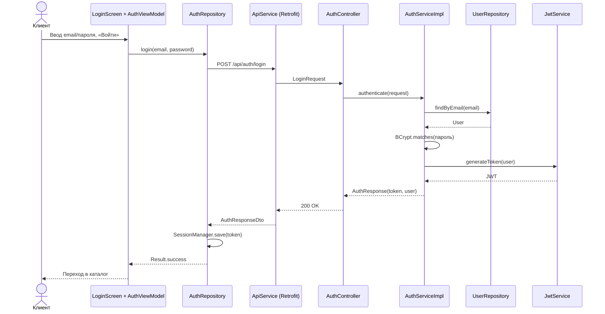
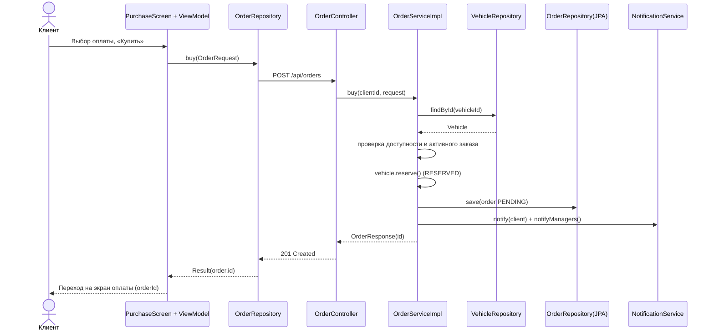
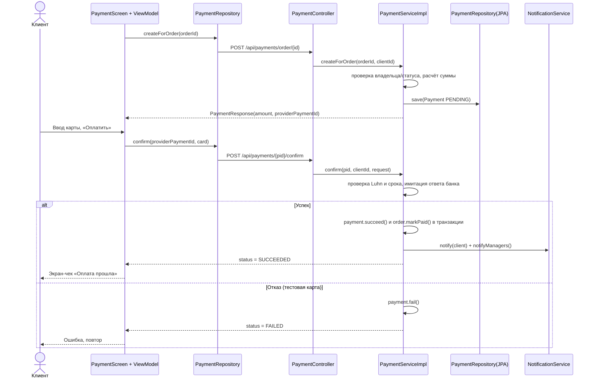
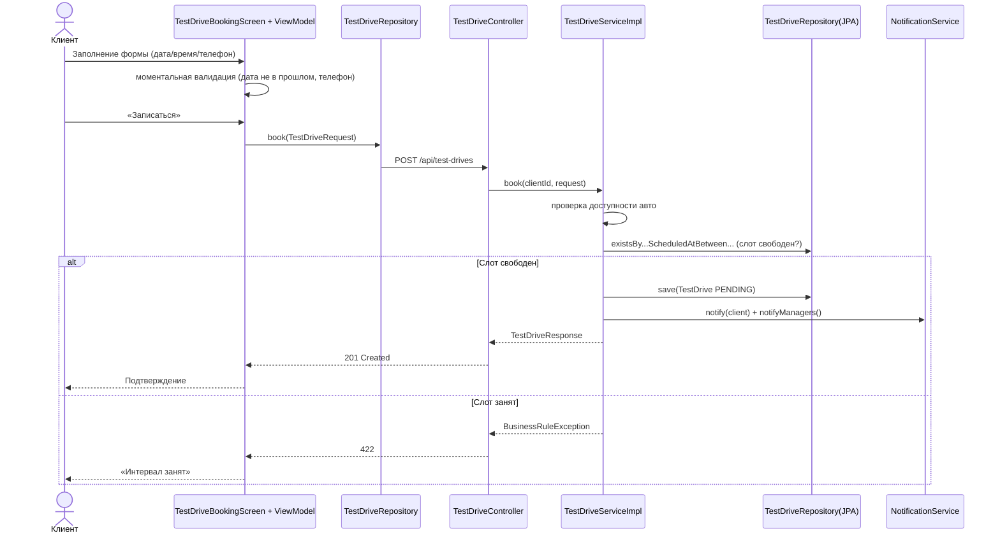

# Диаграммы последовательности

Динамика ключевых сценариев по слоям PCMEF: клиент (P) → сеть → сервер (C → M → E/F) → БД.

## 1. Аутентификация (вход по JWT)

## 2. Оформление покупки и переход к оплате

## 3. Оплата заказа (имитация платёжного шлюза)

## 4. Запись на тест-драйв с уведомлением персонала

