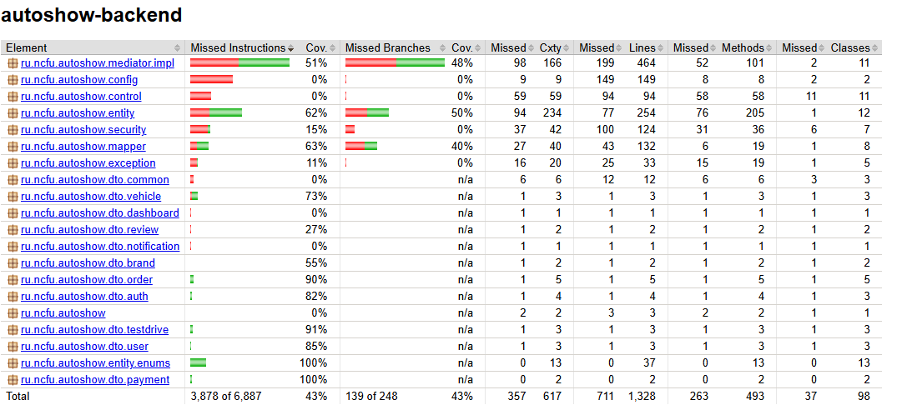
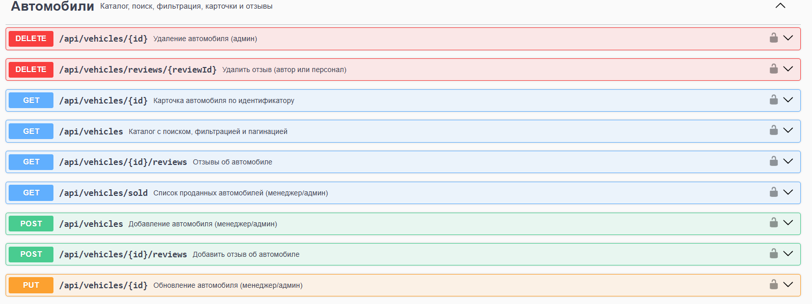
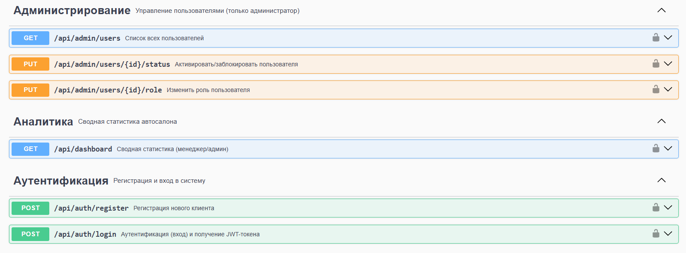
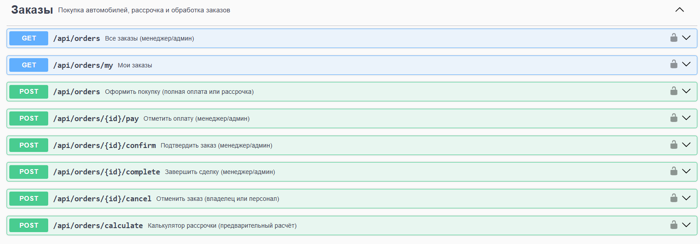
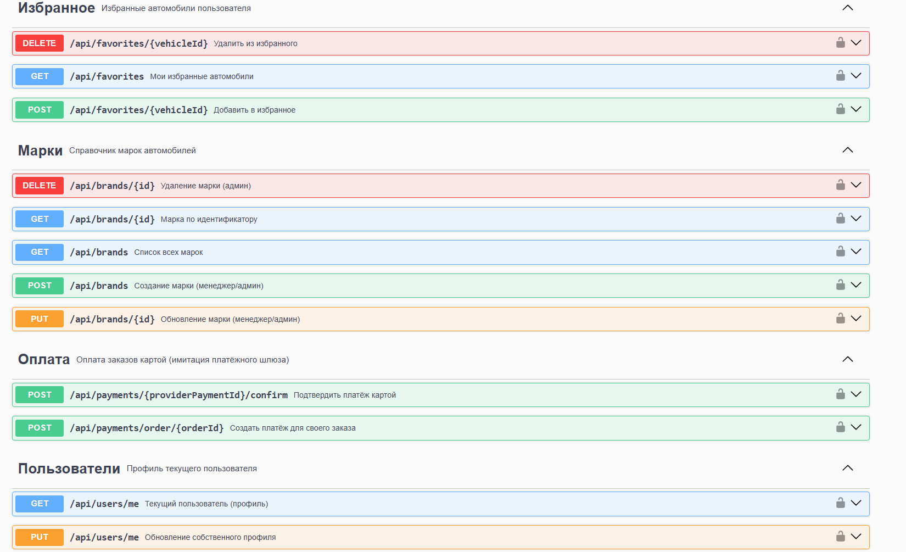
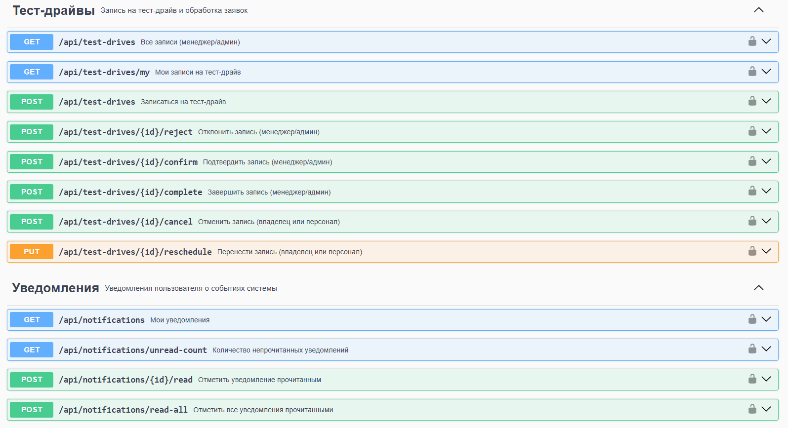

# Отчёт о тестировании и покрытии (Этап 5)

## 1. Подход к тестированию

Тестируется **бизнес-ядро** системы (слои Mediator и Entity) — там сосредоточена логика и
инварианты. Используется **JUnit 5 + Mockito**: репозитории и сторонние сервисы
заменяются моками, что позволяет проверять логику изолированно (без БД и сети). Покрытие
измеряется **JaCoCo**.

## 2. Состав модульных тестов

| Тест | Что проверяет |
|------|----------------|
| `AuthServiceImplTest` | Регистрация/вход, хеширование пароля, выдача токена, отказ при неверных данных |
| `VehicleServiceImplTest` | Карточка авто с рейтингом, отклонение дубликата VIN, 404 для несуществующего |
| `OrderServiceImplTest` | Покупка (резерв авто), отказ при недоступном авто, рассрочка без параметров, калькулятор |
| `TestDriveServiceImplTest` | Успешная запись (`PENDING`), занятый слот → 422, недоступное авто → 422 |
| `PaymentServiceImplTest` | Создание платежа, проверка владельца/статуса, подтверждение (успех/отказ/некорректная карта) |
| `NotificationServiceImplTest` | Рассылка менеджерам, счётчик непрочитанных, RBAC при markRead |
| `FavoriteServiceImplTest` | Исключение проданных из избранного, идемпотентное добавление, удаление |
| `ReviewServiceImplTest` | Запрет повторного отзыва, сохранение, RBAC при удалении |
| `UserServiceImplTest` | 404 для несуществующего, смена роли, блокировка, обновление профиля |
| `JwtServiceTest` (security) | Генерация и валидация JWT, извлечение subject/ролей |
| `OrderTest` (entity) | Конечный автомат статусов заказа, запрет недопустимых переходов |
| `VehicleTest` (entity) | `reserve()`/`markSold()`/`returnToStock()` и их инварианты |
| `InstallmentPlanTest` (entity) | Корректность аннуитетного расчёта и переплаты |
| `PaymentTest` (entity) | Статусная модель платежа (`succeed`/`fail`), маскирование карты |
| `UserTest` (entity) | Признаки ролей (`isStaff` и др.), повышение лояльности |

Итого: **15 тестовых классов, 53 теста**, покрывающих сервисы (Auth, Vehicle, Order,
TestDrive, Payment, Notification, Favorite, Review, User), сущности (Order, Vehicle,
InstallmentPlan, Payment, User) и безопасность (JWT).

**Фактическое покрытие (JaCoCo, прогон `mvn test`):** строки — **46.5 %**, инструкции —
**43.7 %**, ветви — **44.0 %**. Порог МУ (> 40 %) выполнен с запасом.

## 3. Запуск и отчёт о покрытии

Тесты и отчёт о покрытии запускаются через Docker (локальная установка Maven/JDK 17
не требуется) — из папки `application/backend`:

```powershell
docker run --rm -v "${PWD}:/app" -v "$HOME/.m2:/root/.m2" -w /app `
  maven:3.9-eclipse-temurin-17 mvn test
```

HTML-отчёт JaCoCo формируется в `target/site/jacoco/index.html` (плагин подключён в
`pom.xml`). Цель по покрытию ядра — **> 40 %** (требование МУ для траектории В); фокус —
слои Mediator и Entity (бизнес-логика).

**Сводка покрытия JaCoCo:**



## 4. Проверенные сценарии (ручные/интеграционные)

Дополнительно проверены вручную через Swagger UI и приложение:

- JWT-вход и доступ по ролям (RBAC → 403 при нехватке прав).
- Поиск и фильтрация каталога; скрытие проданных авто.
- Калькулятор рассрочки; оформление покупки с резервированием.
- Оплата картой: успешный сценарий и отказ (тестовая карта), идемпотентность.
- Запись на тест-драйв; бизнес-правило занятого слота → 422.
- Валидация полей → 400; нарушение бизнес-правил → 422; Swagger/OpenAPI → 200.

Сгенерированная документация REST API (Swagger UI / OpenAPI):







## 5. Возможности дальнейшего повышения покрытия

Тесты сервисов Notification, Favorite, Payment, Review, User уже добавлены. Для
дальнейшего роста покрытия можно:
- добавить тесты сервисов `Dashboard`, `Brand`;
- интеграционные тесты контроллеров через `MockMvc` (срез web-слоя);
- проверку маппинга Entity ↔ DTO.
