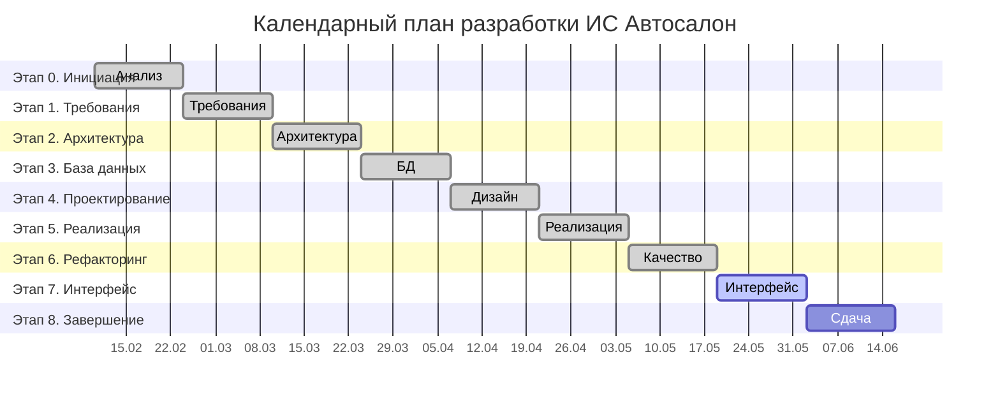

# Календарный план (диаграмма Ганта)

Планирование разработки в период **10.02.2026 – 23.06.2026** (18 недель, 9 этапов).
Диаграмма рендерится на GitHub (Mermaid).

## Соответствие этапов и весов (МУ)

| Этап | Недели | Вес в оценке |
|------|--------|--------------|
| 0. Инициация | 1–2 | 5 % |
| 1. Требования | 3–4 | 10 % |
| 2. Архитектура | 5–6 | 10 % |
| 3. База данных | 7–8 | 10 % |
| 4. Детальное проектирование | 9–10 | 10 % |
| 5. Реализация ядра | 11–12 | 15 % |
| 6. Рефакторинг | 13–14 | 10 % |
| 7. Интерфейс | 15–16 | 15 % |
| 8. Завершение | 17–18 | 15 % |

## Вехи (Milestones)

- **M1** (нед. 4): утверждена модель требований.
- **M2** (нед. 8): спроектирована БД (3НФ), готов DDL.
- **M3** (нед. 12): работает ядро (сервер + клиент), проходят тесты.
- **M4** (нед. 16): завершён интерфейс и ключевые сценарии (включая оплату).
- **M5** (нед. 18): готов полный комплект документации, проект к защите.
