# Иерархическая структура работ (WBS)

Декомпозиция проекта на пакеты работ по уровням (WBS, Work Breakdown Structure).

```mermaid
flowchart TB
    P["1. ИС «Автосалон»"]

    P --> W1["1.1 Инициация и анализ"]
    P --> W2["1.2 Требования"]
    P --> W3["1.3 Архитектура"]
    P --> W4["1.4 База данных"]
    P --> W5["1.5 Детальное проектирование"]
    P --> W6["1.6 Реализация"]
    P --> W7["1.7 Качество"]
    P --> W8["1.8 Документация и сдача"]

    W1 --> W1a["1.1.1 Паспорт, IDEF0, BUC"]
    W1 --> W1b["1.1.2 SWOT, стейкхолдеры, ROI"]

    W2 --> W2a["1.2.1 Use Case + спецификации"]
    W2 --> W2b["1.2.2 Domain Model, трассировка"]

    W3 --> W3a["1.3.1 Диаграмма пакетов, интерфейсы"]
    W3 --> W3b["1.3.2 ADR, зависимости"]

    W4 --> W4a["1.4.1 ER-модель, DDL (3НФ)"]
    W4 --> W4b["1.4.2 ORM-маппинг, сиды"]

    W5 --> W5a["1.5.1 Sequence-диаграммы"]
    W5 --> W5b["1.5.2 Классы проектирования, методы"]

    W6 --> W6a["1.6.1 Сервер: Entity, Foundation"]
    W6 --> W6b["1.6.2 Сервер: Mediator, Control, API"]
    W6 --> W6c["1.6.3 Клиент: данные, экраны, навигация"]
    W6 --> W6d["1.6.4 Оплата (имитация шлюза)"]

    W7 --> W7a["1.7.1 Модульные тесты, JaCoCo"]
    W7 --> W7b["1.7.2 Статический анализ, рефакторинг"]

    W8 --> W8a["1.8.1 ТЗ, руководства"]
    W8 --> W8b["1.8.2 WBS, Гант, COCOMO"]
    W8 --> W8c["1.8.3 Пояснительная записка, презентация"]
```

## Словарь пакетов работ (выдержка)

| Код | Пакет работ | Результат (deliverable) | Оценка, ч |
|-----|-------------|--------------------------|-----------|
| 1.1 | Инициация и анализ | Паспорт, IDEF0, BUC, SWOT, ROI | 10 |
| 1.2 | Требования | Use Case, спецификации, Domain Model, трассировка | 12 |
| 1.3 | Архитектура | Диаграмма пакетов, интерфейсы, ADR | 10 |
| 1.4 | База данных | ER, DDL (3НФ), ORM-маппинг | 10 |
| 1.5 | Детальное проектирование | Sequence, классы, методы | 12 |
| 1.6 | Реализация | Сервер + клиент + оплата | 45 |
| 1.7 | Качество | Тесты, покрытие, статический анализ | 12 |
| 1.8 | Документация и сдача | ТЗ, руководства, пояснительная записка | 14 |
| | **Итого** | | **≈ 125 ч** |

> Календарное распределение — в [диаграмме Ганта](gantt-chart.md); оценка трудозатрат
> расчётным методом — в [COCOMO](cocomo-estimation.md).
